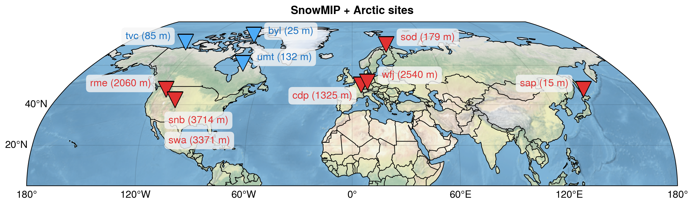
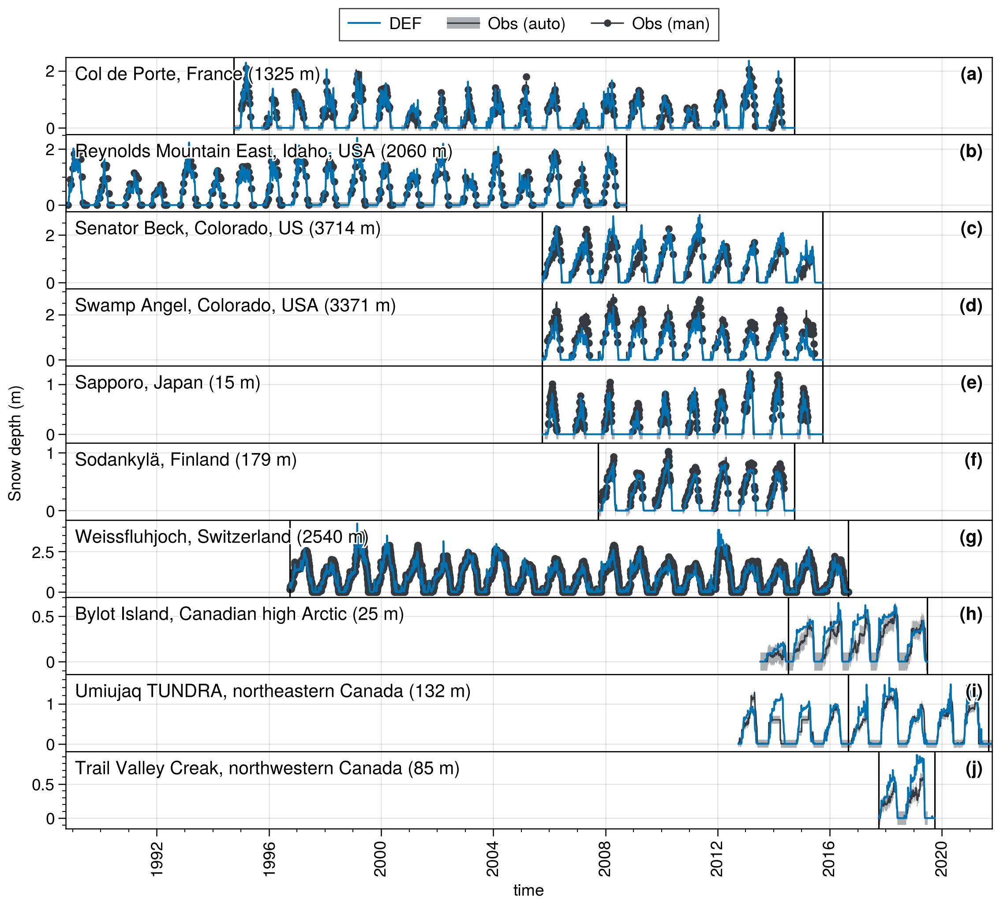
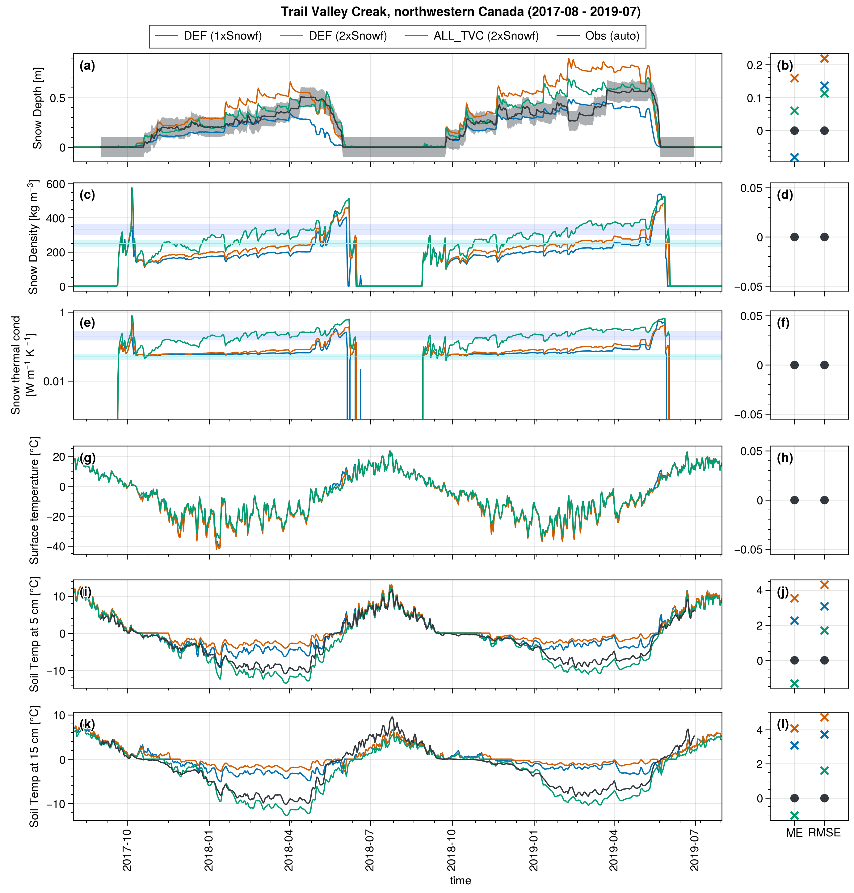

# Improving the CLASSIC (v1.8) Snow Model to Better Simulate Arctic Snowpacks

This repository gathers the code used to make the analyses of the paper published in Geoscientific Model Development (GMD):

>Lalande et al.: Improving the CLASSIC (v1.8) Snow Model to Better Simulate Arctic Snowpacks

## Code

The model code is available in another repository: [CLASSIC-SnowC2-1D](https://github.com/mickaellalande/CLASSIC-SnowC2-1D/tree/SnowC2-1D)

## Figures

- Figure 1: [plot_sites_v1.ipynb](https://github.com/mickaellalande/SnowC2/blob/main/CLASSIC/in_situ/SnowMIP/plot_sites_v1.ipynb)

- Figure 2: [fig5_annual-cycles.ipynb](fig5_annual-cycles.ipynb)

- Figure 3, B1, B2: [fig2_tas-bias.ipynb](fig2_tas-bias.ipynb), [figS1_snc-bias.ipynb](figS1_snc-bias.ipynb), [figS2_pr-bias.ipynb](figS2_pr-bias.ipynb)

## Appendix Figures

- Figure A1: [paper_snd_ts_correct_SH.ipynb](https://github.com/mickaellalande/SnowC2/blob/main/CLASSIC/in_situ/paper_snd_ts_correct_SH.ipynb)

## Supplement Figures

- Figure S1: [run_1peat_mtr_opti_Snowfx2_DEF_correct_SH.ipynb](https://github.com/mickaellalande/SnowC2/blob/main/CLASSIC/in_situ/SnowArctic/tvc/outputs/run_1peat_mtr_opti_Snowfx2_DEF_correct_SH.ipynb)

