# Improving the CLASSIC (v1.8) Snow Model to Better Simulate Arctic Snowpacks

This repository gathers the code used to make the analyses of the paper published in Geoscientific Model Development (GMD):

>Lalande et al.: Improving the CLASSIC (v1.8) Snow Model to Better Simulate Arctic Snowpacks

## Code

The model code is available in another repository: [CLASSIC-SnowC2-1D](https://github.com/mickaellalande/CLASSIC-SnowC2-1D/tree/SnowC2-1D)

## Figures

- Figure 1: [plot_sites_v1.ipynb](https://github.com/mickaellalande/SnowC2/blob/main/CLASSIC/in_situ/SnowMIP/plot_sites_v1.ipynb)

[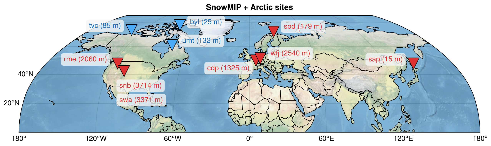](https://github.com/mickaellalande/SnowC2/blob/main/CLASSIC/in_situ/SnowMIP/plot_sites_arc_v1.pdf)

- Figure 2: [rho_max_v2.ipynb](https://github.com/mickaellalande/SnowC2/blob/main/CLASSIC/in_situ/rho_max_v2.ipynb)

[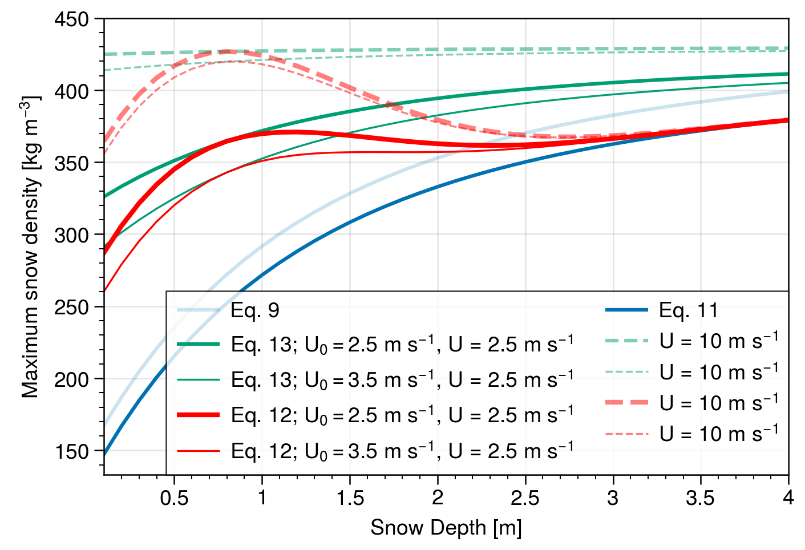](https://github.com/mickaellalande/SnowC2/blob/main/CLASSIC/in_situ/img/rho_max_vs_sd_gauss_final_v2.pdf)

- Figure 3: [paper_ac_rank_ALL_correct_SH.ipynb](https://github.com/mickaellalande/SnowC2/blob/main/CLASSIC/in_situ/paper_ac_rank_ALL_correct_SH.ipynb)

[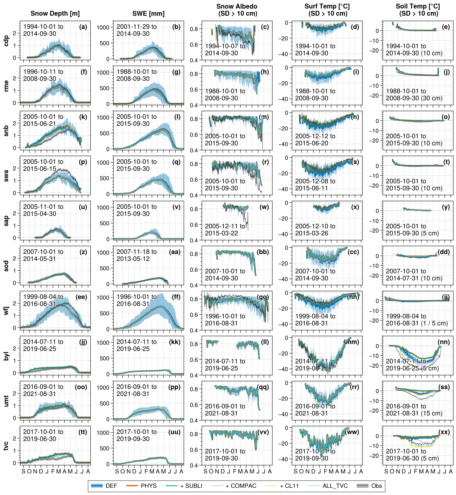](https://github.com/mickaellalande/SnowC2/blob/main/CLASSIC/in_situ/img/paper_ac_all_v3_correct_SH.pdf)

- Figure 4: [TSNBOT_figures.ipynb](https://github.com/mickaellalande/SnowC2/blob/main/CLASSIC/in_situ/SnowMIP/cdp/outputs/TSNBOT_figures_v3.ipynb)

[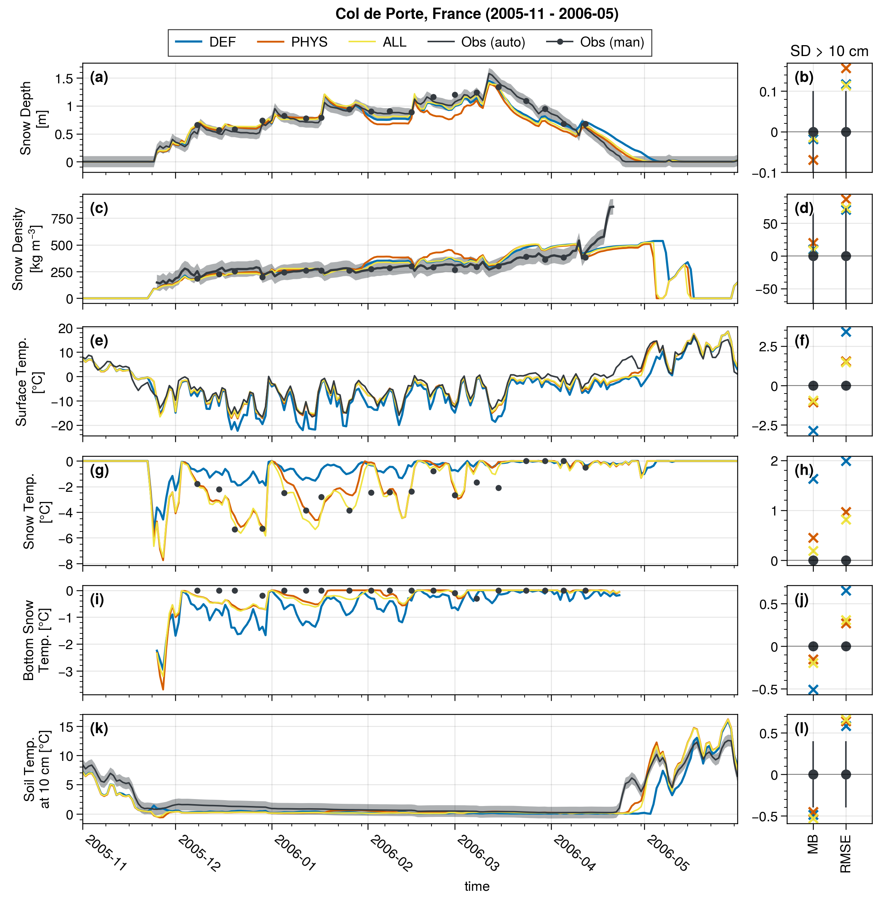](https://github.com/mickaellalande/SnowC2/blob/main/CLASSIC/in_situ/SnowMIP/cdp/outputs/img/cdp_TSNBOT_2005-2006_v3.pdf)

- Figure 5: [run_peat_byl_paper.ipynb](https://github.com/mickaellalande/SnowC2/blob/main/CLASSIC/in_situ/SnowArctic/byl/outputs/run_peat_byl_paper.ipynb)

[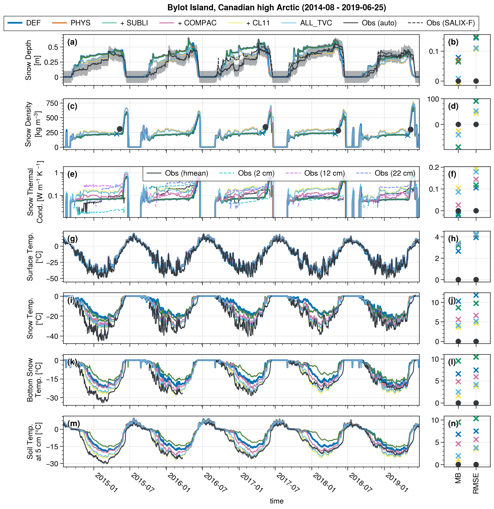](https://github.com/mickaellalande/SnowC2/blob/main/CLASSIC/in_situ/SnowArctic/byl/outputs/img/byl_peat_paper_all_2014-2019_v2.pdf)

- Figure 6 and 7: [paper_ac_rank_ALL_correct_SH.ipynb](https://github.com/mickaellalande/SnowC2/blob/main/CLASSIC/in_situ/paper_ac_rank_ALL_correct_SH.ipynb)

[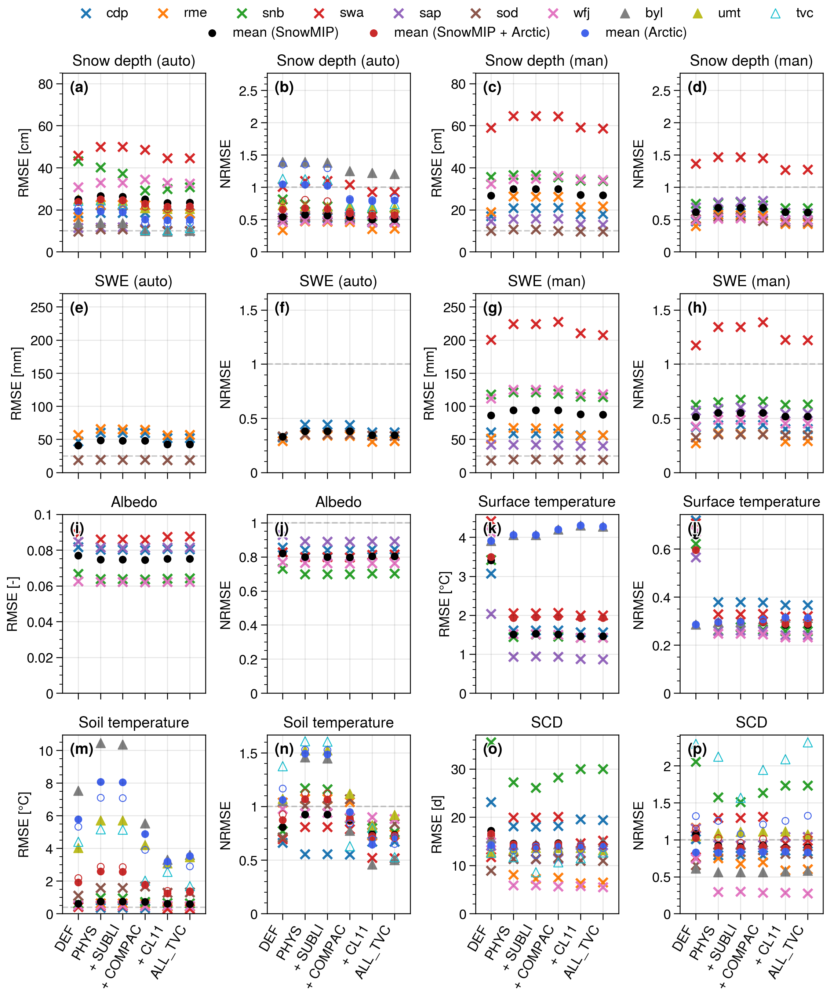](https://github.com/mickaellalande/SnowC2/blob/main/CLASSIC/in_situ/img/paper_rmse_all_v1_correct_SH.pdf)
[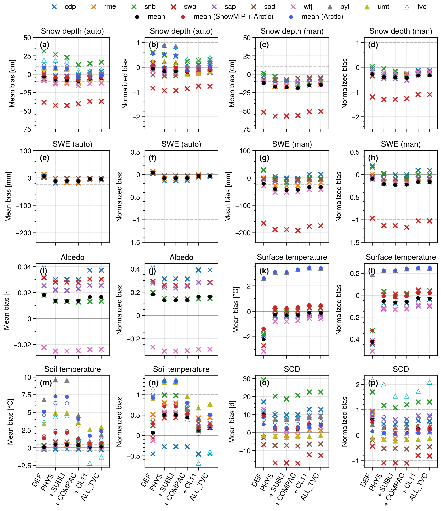](https://github.com/mickaellalande/SnowC2/blob/main/CLASSIC/in_situ/img/paper_mb_all_v1_correct_SH.pdf)

## Appendix Figures

- Figure A1: [paper_snd_ts_correct_SH.ipynb](https://github.com/mickaellalande/SnowC2/blob/main/CLASSIC/in_situ/SnowArctic/byl/outputs/run_peat_TCZE_ALL_TSNB_final.ipynb)

[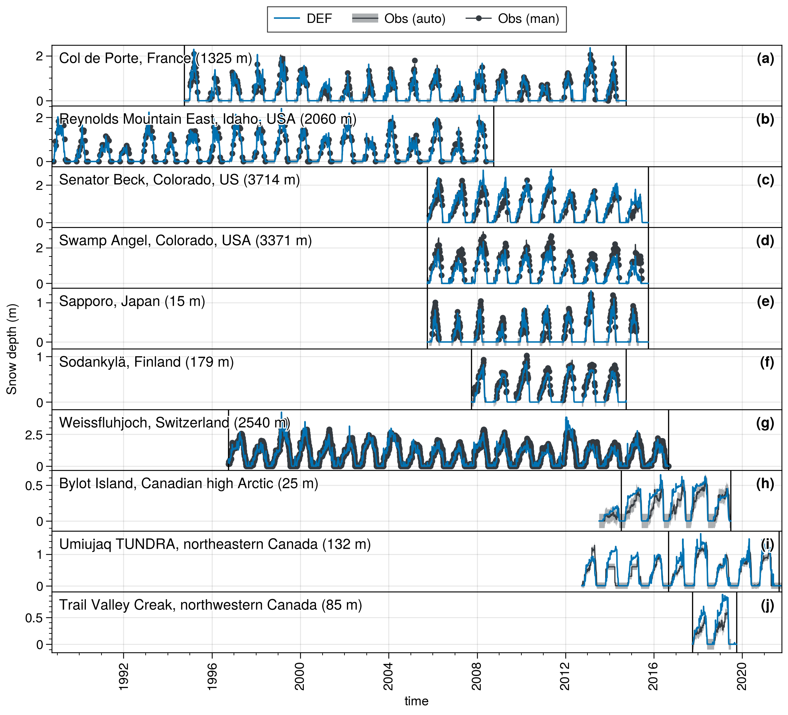](https://github.com/mickaellalande/SnowC2/blob/main/CLASSIC/in_situ/img/snd_ts_v1_correct_SH.pdf)

- Figure B1: [run_peat_TCZE_ALL_TSNB_final.ipynb](https://github.com/mickaellalande/SnowC2/blob/main/CLASSIC/in_situ/SnowArctic/byl/outputs/run_peat_TCZE_ALL_TSNB_final.ipynb)

[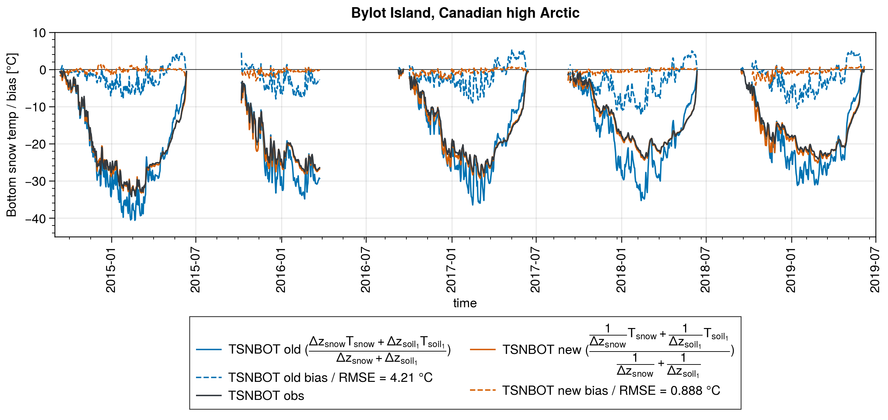](https://github.com/mickaellalande/SnowC2/blob/main/CLASSIC/in_situ/SnowArctic/byl/outputs/img/byl_tsnbot_2015-2019_final_v0.pdf)

- Figure B2: [TSNBOT_figures.ipynb](https://github.com/mickaellalande/SnowC2/blob/main/CLASSIC/in_situ/SnowMIP/cdp/outputs/TSNBOT_figures_v3.ipynb)

[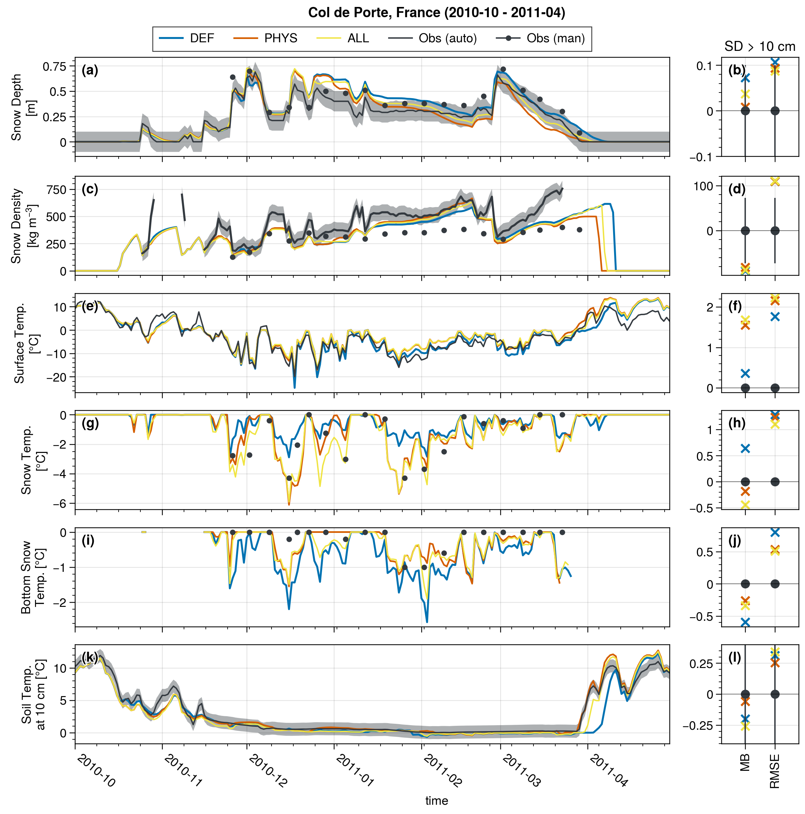](https://github.com/mickaellalande/SnowC2/blob/main/CLASSIC/in_situ/SnowMIP/cdp/outputs/img/cdp_TSNBOT_2010-2011_v3.pdf)

- Figure C1: [paper_ac_rank_PHYS_correct_SH_v2.ipynb](https://github.com/mickaellalande/SnowC2/blob/main/CLASSIC/in_situ/paper_ac_rank_PHYS_correct_SH_v2.ipynb)

[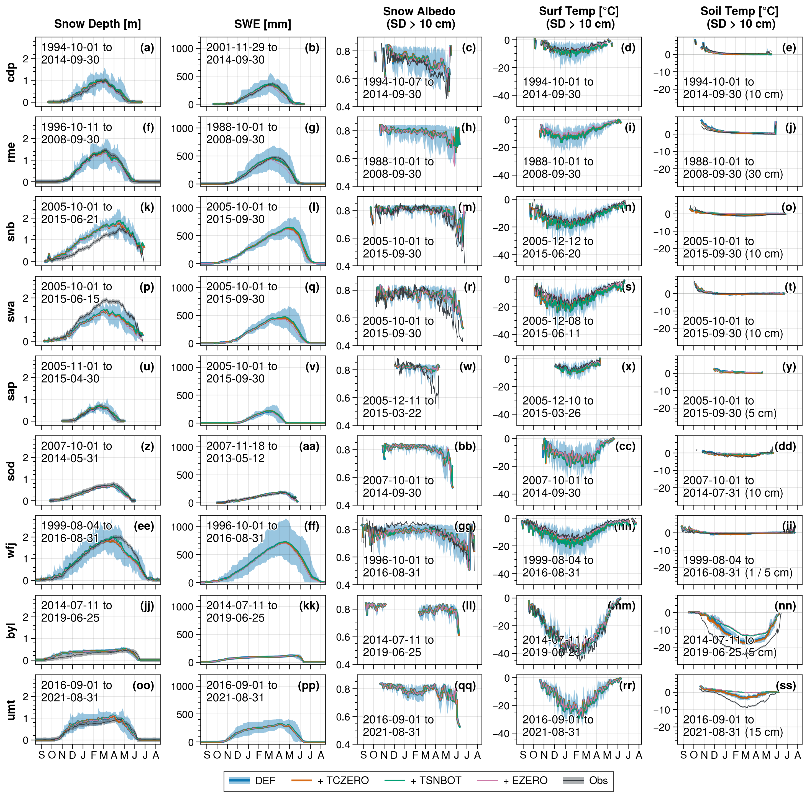](https://github.com/mickaellalande/SnowC2/blob/main/CLASSIC/in_situ/img/paper_ac_phys_v3_correct_SH.pdf)

- Figure C2 and C3: [paper_ac_rank_PHYS_correct_SH.ipynb](https://github.com/mickaellalande/SnowC2/blob/main/CLASSIC/in_situ/paper_ac_rank_PHYS_correct_SH.ipynb)

[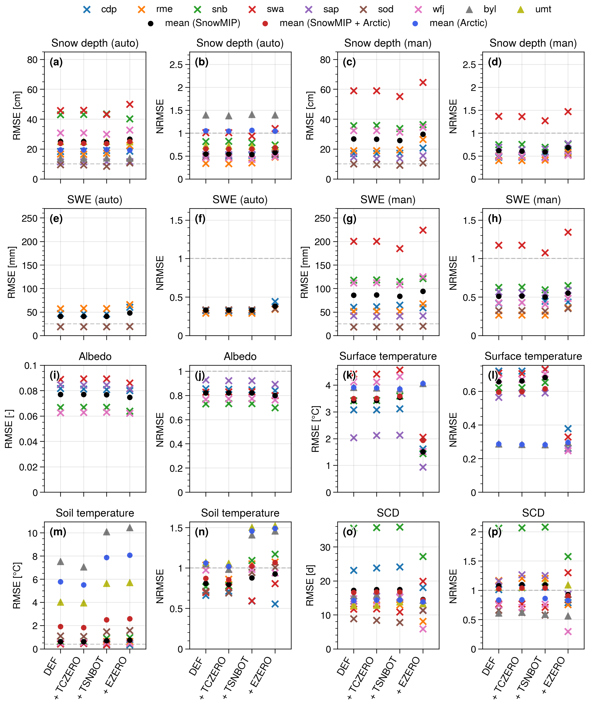](https://github.com/mickaellalande/SnowC2/blob/main/CLASSIC/in_situ/img/paper_rmse_phys_v1_correct_SH.pdf)
[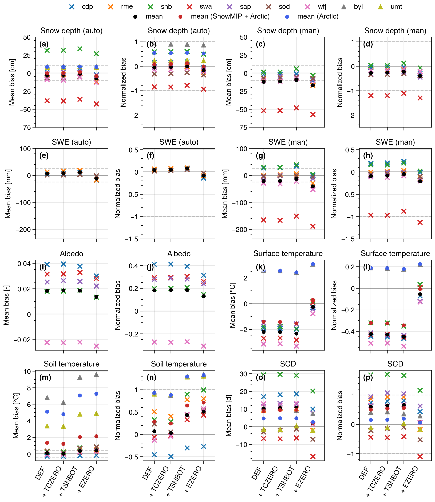](https://github.com/mickaellalande/SnowC2/blob/main/CLASSIC/in_situ/img/paper_mb_phys_v1_correct_SH.pdf)

- Figure D1: [run_umt_paper_correct_SH.ipynb](https://github.com/mickaellalande/SnowC2/blob/main/CLASSIC/in_situ/SnowArctic/umt/outputs/run_umt_paper_correct_SH.ipynb)

[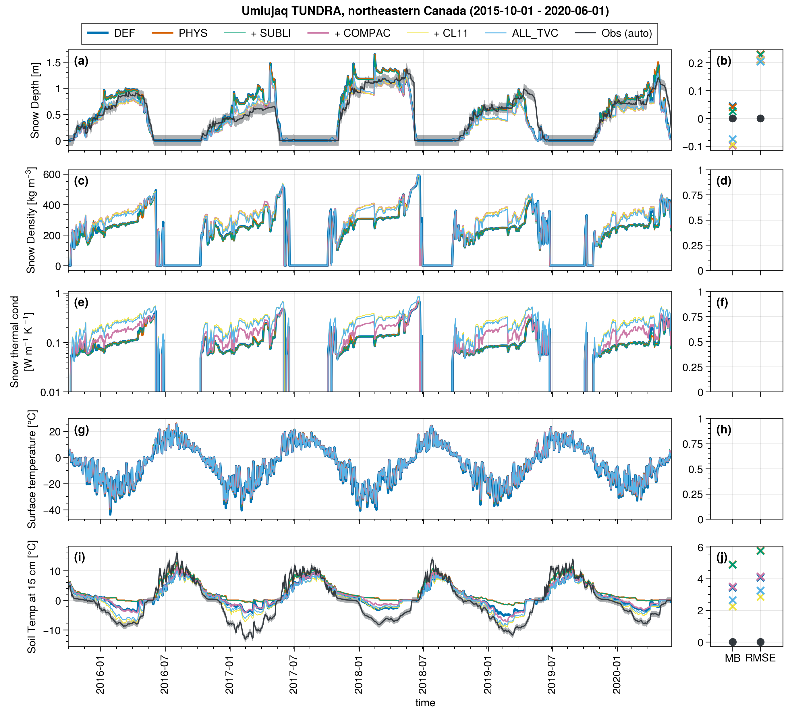](https://github.com/mickaellalande/SnowC2/blob/main/CLASSIC/in_situ/SnowArctic/umt/outputs/img/umt_paper_all_2016-2020_correct_SH_v1.pdf)

- Figure D2: [run_1peat_tvc_paper_correct_SH.ipynb](https://github.com/mickaellalande/SnowC2/blob/main/CLASSIC/in_situ/SnowArctic/tvc/outputs/run_1peat_tvc_paper_correct_SH.ipynb)

[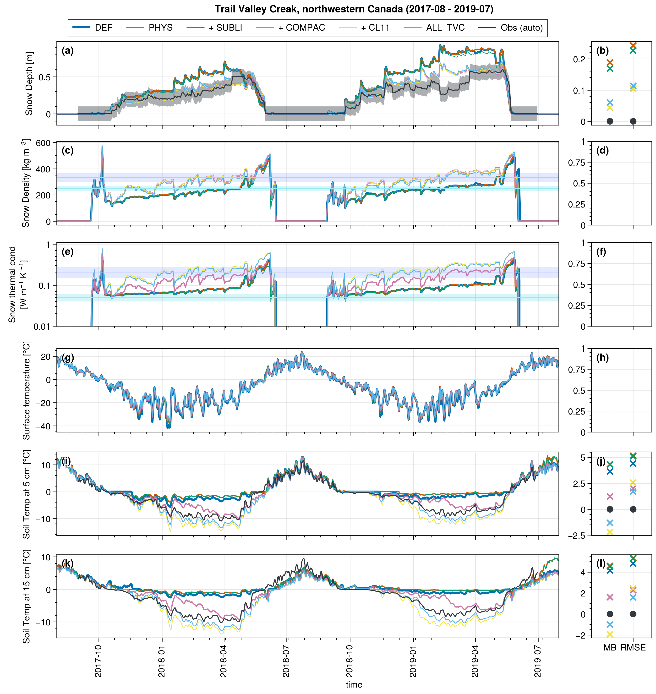](https://github.com/mickaellalande/SnowC2/blob/main/CLASSIC/in_situ/SnowArctic/tvc/outputs/img/tvc_1peat_paper_2017-2019_correct_SH_v1.pdf)

## Supplement Figures

- Figure S1: [spinup_Ref_30min_ext.ipynb](https://github.com/mickaellalande/SnowC2/blob/main/CLASSIC/in_situ/SnowMIP/cdp/outputs/spinup_Ref_30min_ext.ipynb)

[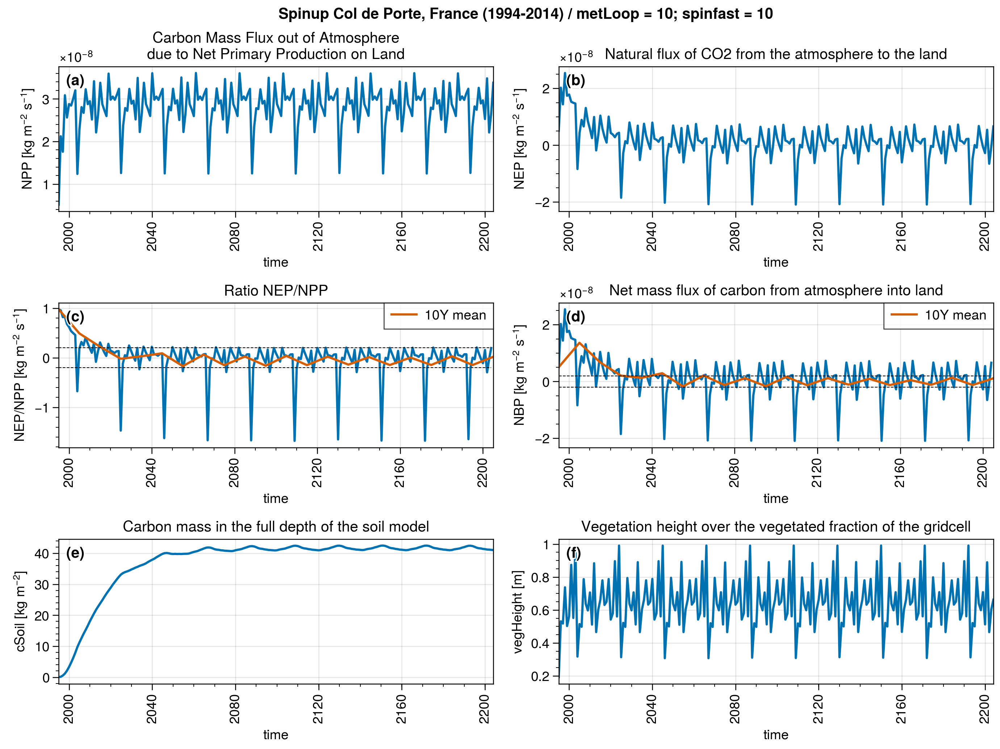](https://github.com/mickaellalande/SnowC2/blob/main/CLASSIC/in_situ/SnowMIP/cdp/outputs/img/spinup_cdp.pdf)

- Figure S2: [paper_ac_albedo_correct_SH_v2.ipynb](https://github.com/mickaellalande/SnowC2/blob/main/CLASSIC/in_situ/paper_ac_albedo_correct_SH_v2.ipynb)

[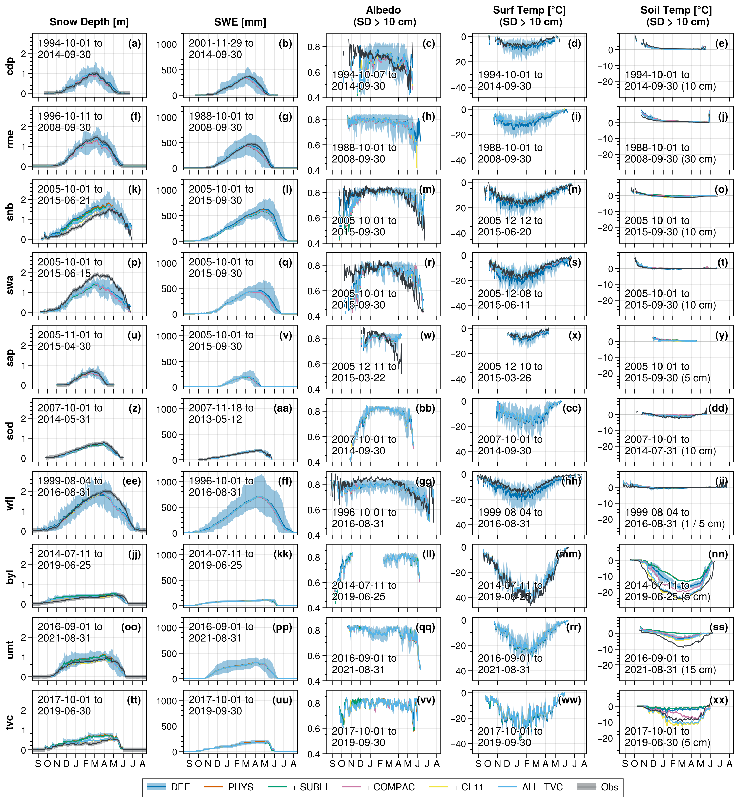](https://github.com/mickaellalande/SnowC2/blob/main/CLASSIC/in_situ/img/paper_ac_all_albedo_v2_correct_SH.pdf)

- Figure S3: [run_1peat_mtr_opti_Snowfx2_DEF_correct_SH.ipynb](https://github.com/mickaellalande/SnowC2/blob/main/CLASSIC/in_situ/SnowArctic/tvc/outputs/run_1peat_mtr_opti_Snowfx2_DEF_correct_SH.ipynb)

[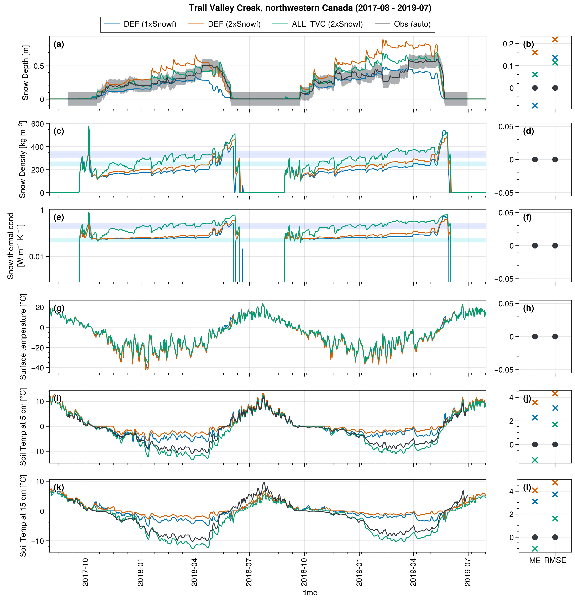](https://github.com/mickaellalande/SnowC2/blob/main/CLASSIC/in_situ/SnowArctic/tvc/outputs/img/tvc_1peat_paper_2017-2019_Snowf_correct_SH.pdf)

- Figure S4: [run_paper_vwc.ipynb](https://github.com/mickaellalande/SnowC2/blob/main/CLASSIC/in_situ/SnowArctic/run_paper_vwc.ipynb)

[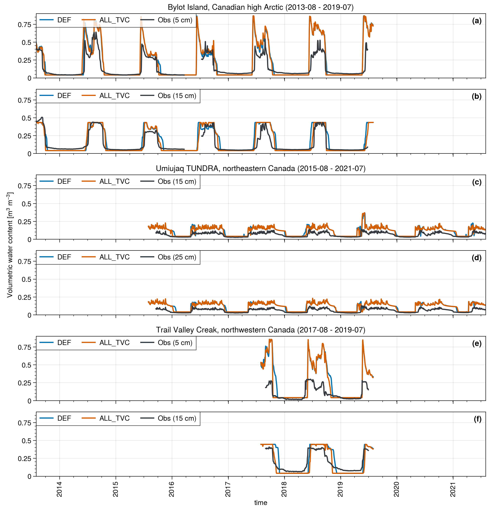](https://github.com/mickaellalande/SnowC2/blob/main/CLASSIC/in_situ/SnowArctic/arctic_vwc.pdf)

- Figure S5 and S6: [run_paper_nee_v3_correct_SH.ipynb](https://github.com/mickaellalande/SnowC2/blob/main/CLASSIC/in_situ/SnowArctic/run_paper_nee_v3_correct_SH.ipynb)

[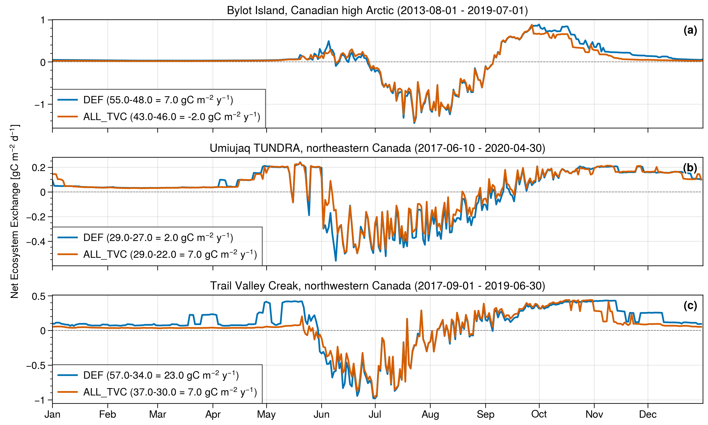](https://github.com/mickaellalande/SnowC2/blob/main/CLASSIC/in_situ/SnowArctic/arctic_nee_correct_SH_no_obs_v3.pdf)
[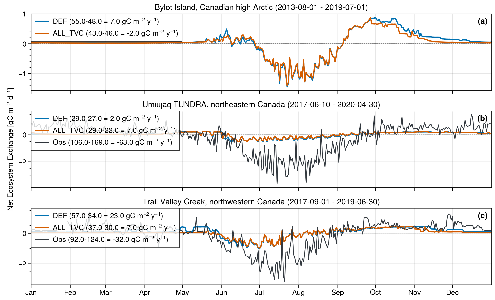](https://github.com/mickaellalande/SnowC2/blob/main/CLASSIC/in_situ/SnowArctic/arctic_nee_correct_SH_v3.pdf)

